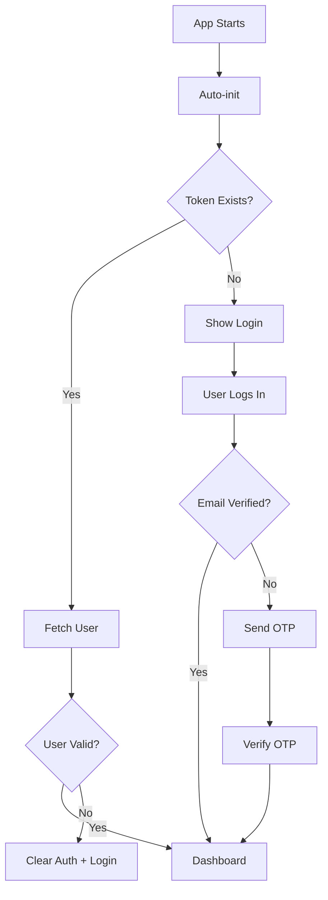

# React Auth Store - Vue Pinia Equivalent

This project provides a React authentication store using Zustand that perfectly mirrors your Vue Pinia auth store functionality.

## 🚀 Quick Start

1. **Install dependencies:**
```bash
npm install
```

2. **Configure environment:**
```bash
# Create .env file from example
cp .env.example .env

# Update your API URL in .env
VITE_BASE_API=http://your-api-domain.com/api
```

3. **Start development:**
```bash
npm run dev
```

## 📁 Clean Project Structure

```
src/
├── stores/
│   └── authStore.js          # 🎯 Main auth store (Pinia equivalent)
├── utils/
│   └── axios.js              # 🔧 API configuration & interceptors
├── App.jsx                   # 📱 Working examples & routing
└── assets/                   # 🖼️ Static files
```

## 🎯 Auth Store Usage (Just Like Pinia!)

**Import and use exactly like Pinia:**

```javascript
import { useAuthStore } from './stores/authStore';

function LoginForm() {
  // Destructure state and actions (same as Pinia)
  const { user, loading, login, logout } = useAuthStore();
  
  const handleLogin = async (credentials) => {
    const result = await login(credentials);
    if (result.success && result.isVerified) {
      console.log('Login successful!');
    }
  };

  return (
    <div>
      {user ? (
        <div>
          <h1>Welcome, {user.name}!</h1>
          <button onClick={logout}>Logout</button>
        </div>
      ) : (
        <form onSubmit={handleLogin}>
          {/* Login form */}
        </form>
      )}
    </div>
  );
}
```

## 🔥 Why Zustand = Pinia for React

- ✅ **Same API**: `const { state, action } = useStore()`
- ✅ **Global state**: Shared across all components
- ✅ **Auto-persistence**: Built-in localStorage sync
- ✅ **Zero boilerplate**: No providers or wrappers needed
- ✅ **TypeScript ready**: Full type safety
- ✅ **Minimal bundle**: Only 2.5kb gzipped

## ⚡ Complete Feature Set

**All your Vue Pinia store features, perfectly replicated:**

| Feature | Status | Function |
|---------|---------|----------|
| User Registration | ✅ | `register(userData)` |
| Login with Email Verification | ✅ | `login(credentials)` |
| OTP Send & Verify | ✅ | `sendOtp(data)` / `verifyOtp(data)` |
| User Session Management | ✅ | `fetchUser()` / `init()` |
| Secure Logout | ✅ | `logout()` |
| UPI ID Updates | ✅ | `updateUpiId(newId)` |
| Password Reset | ✅ | `resetPassword(data)` |
| Auto-persistence | ✅ | Automatic token & user storage |
| Loading States | ✅ | Global loading management |
| Error Handling | ✅ | Consistent error responses |

## � Real Usage Examples

### 1. **Login Flow**
```javascript
const { login, loading, user } = useAuthStore();

const handleLogin = async (e) => {
  e.preventDefault();
  const formData = new FormData(e.target);
  
  const result = await login({
    email: formData.get('email'),
    password: formData.get('password'),
  });
  
  if (result.success && result.isVerified) {
    navigate('/dashboard');
  } else if (result.success && !result.isVerified) {
    // OTP verification flow automatically triggered
    console.log('Please verify your email');
  }
};
```

### 2. **Registration + OTP**
```javascript
const { register, verifyOtp, verifyEmail } = useAuthStore();

// Register user
const registerResult = await register(userData);
if (registerResult.success) {
  // Auto-redirects to OTP verification
}

// Verify OTP
const otpResult = await verifyOtp({
  email: verifyEmail,
  otp: '123456',
  label: 'verify_email'
});
```

### 3. **Protected Dashboard**
```javascript
const { user, logout, updateUpiId } = useAuthStore();

if (!user) return <Navigate to="/login" />;

return (
  <div>
    <h1>Welcome, {user.name}!</h1>
    <p>Email: {user.email}</p>
    <p>UPI: {user.upi_id || 'Not set'}</p>
    
    <button onClick={async () => {
      const result = await updateUpiId('user@paytm');
      if (result.success) alert('UPI updated!');
    }}>
      Update UPI
    </button>
    
    <button onClick={logout}>Logout</button>
  </div>
);
```

## � Authentication Flow



## 🌐 API Integration

**Seamless Laravel Sanctum integration:**

- ✅ **CSRF Protection**: Automatic cookie handling
- ✅ **Bearer Tokens**: Auto-attached to requests  
- ✅ **Token Refresh**: Automatic on 401 errors
- ✅ **Request Interceptors**: Headers & auth management
- ✅ **Error Handling**: Consistent API error parsing

## 🎯 Migration from Vue Pinia

**It's almost identical! Just change the import:**

```javascript
// Vue Pinia (before)
import { useAuthStore } from '@/stores/auth'

// React Zustand (now)
import { useAuthStore } from './stores/authStore'

// Usage is exactly the same!
const { user, login, logout, loading } = useAuthStore()
```

## 🚀 Ready to Use!

Your React auth store is production-ready with:
- 🔒 Secure token management
- 📱 Complete auth flow examples in `App.jsx`
- 🔄 Automatic state persistence
- 🎯 100% feature parity with your Vue Pinia store

Just update your `.env` with your API URL and start building! 🎉
